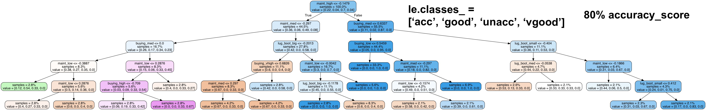
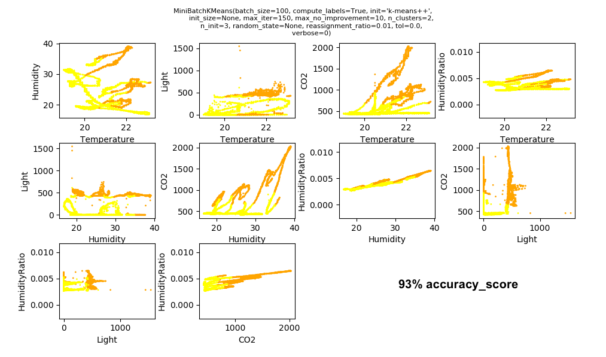

# Machine-Learning-Playground
This repository is a hodgepodge of machine learning. Clustering algorithms, data visualization techniques, and other ML algorithms are used  implemented in various files. 
Files:
- clustering.py = trying out various cluster algorithms and graphing each algorithm's performance in its own figure with many subplots where each subplot is color coded by the cluster
- dec_tree_viz.py = basic attempt at visualizing a decision tree
- nn_to_decision_tree.py = attempt to approximate a neural network with a decision tree in order to be able to interpret the neural net

- cluster_scatters.png = one such of the figure for a clustering algorithm with many subplots (clustering.py)
- tree.png = decision tree from the dataset (dec_tree_viz.py)
- dt_reg_093333.png and dt_appx_of_mlp_095555.png = former is regular decision tree w/ 0.93333 accuracy while latter is a decision tree approximation of a neural network w/ 0.95555 accuracy (nn_to_decision_tree.py)

Some example images: 

